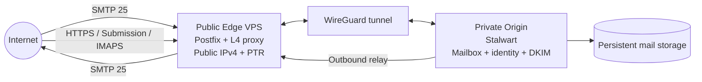

# MailForge

MailForge is a reusable, self-hosted, multi-domain email platform designed for operators whose mailbox server may live behind CGNAT.

The project separates the **public Internet mail edge** from the **private mailbox origin**:

- **Postfix edge MTA** on a small public VPS for Internet-facing SMTP on TCP/25, queueing, and outbound delivery.
- **WireGuard** as the private transport between the public edge and the origin.
- **Stalwart Mail Server** on the origin for domains, accounts, mailbox storage, IMAP/JMAP, authenticated submission, DKIM signing, and administrative APIs/UI.
- **Layer-4 proxying** on the edge for client-facing protocols that must reach Stalwart without exposing the origin directly.

MailForge is intentionally domain-neutral. One deployment can serve `example.com`, `example.org`, and future domains without changing the architecture.

> Status: **documentation foundation complete; implementation has not started.**

## Why MailForge exists

A conventional home-hosted mail server is difficult behind CGNAT because other mail servers must be able to reach TCP/25 and reputable outbound SMTP needs a stable public IP and reverse DNS. MailForge works around this by giving the deployment a small public edge while keeping mailbox state on infrastructure controlled by the operator.

## High-level architecture

The edge is disposable infrastructure. The origin is the authoritative home of mailbox state.

## Documentation

Start with [docs/INDEX.md](docs/INDEX.md). Important documents include:

- [Project charter](docs/PROJECT_CHARTER.md)
- [Requirements](docs/REQUIREMENTS.md)
- [Architecture](docs/ARCHITECTURE.md)
- [Configuration model](docs/CONFIGURATION_MODEL.md)
- [Networking](docs/NETWORKING.md)
- [DNS and deliverability](docs/DNS_AND_DELIVERABILITY.md)
- [Security model](docs/SECURITY_MODEL.md)
- [Operations](docs/OPERATIONS.md)
- [Backup and recovery](docs/BACKUP_AND_RECOVERY.md)
- [Test strategy](docs/TEST_STRATEGY.md)
- [Roadmap](docs/ROADMAP.md)
- [Implementation plan](docs/IMPLEMENTATION_PLAN.md)
- [Architecture Decision Records](docs/adr/README.md)

## Non-goals for v1

MailForge v1 is not intended to be a commercial multi-tenant SaaS, a bulk-mail platform, a newsletter sender, an anonymous relay, or a replacement for domain registration/DNS hosting.

## License

Apache License 2.0. See [LICENSE](LICENSE).
