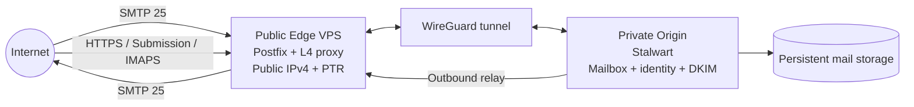

# MailForge

MailForge is a reusable, self-hosted, multi-domain email platform designed for operators whose mailbox server may live behind CGNAT.

> **Status:** Phase 0 documentation is complete and Phase 1 repository/local scaffolding is implemented. The Internet mail path is not production-ready. No VPS deployment or DNS/mail cutover has started.

MailForge separates the **public Internet mail edge** from the **private mailbox origin**:

- **Postfix edge MTA** will own Internet-facing SMTP on TCP/25, queueing, and outbound delivery.
- **WireGuard** will provide private transport between the public edge and the origin.
- **Stalwart Mail Server** is the authoritative source for domains, accounts, mailboxes, aliases, DKIM, and message storage.
- **Layer-4 proxying** will forward client protocols to Stalwart, where TLS terminates.

The repository is domain-neutral. One deployment can serve `example.com`, `example.org`, and future domains without duplicating the mail infrastructure.

## Phase 1 scaffold

Phase 1 adds edge/origin/tunnel boundaries, safe domain-neutral examples, a local Compose topology, secret protections, validation tooling, tests, and CI. Compose services use the opt-in `local-scaffold` profile, an internal Docker network, and no published host ports. The Postfix baseline has no relay domains and rejects unauthenticated relay. These files are not a complete mail service and must not be deployed as production configuration.

The current milestone does not include a working Internet SMTP path, real WireGuard keys, production credentials, live domains, server provisioning, DNS changes, or mail-provider changes. The next milestone is Phase 2: a local two-node mail path.

## Validate locally

From the repository root:

```sh
python scripts/validate_config.py --env-file .env.example
python -m unittest discover -s tests -p 'test_*.py' -v
docker compose --profile local-scaffold config --quiet
```

For a deployment-specific configuration, copy `.env.example` to an untracked `.env` and validate it with `python scripts/validate_config.py --env-file .env`. Production validation rejects example hostnames/domains and TEST-NET addresses. Never put secrets in `.env.example` or Git.

`docker compose ... config` only renders the Compose model. Do not start the services until the Phase 2 configuration and tests are complete.

## High-level architecture



The edge is replaceable transport infrastructure. The origin is the authoritative home of mailbox state.

## Documentation

Start with [docs/INDEX.md](docs/INDEX.md). Important documents include:

- [Project charter](docs/PROJECT_CHARTER.md)
- [Requirements](docs/REQUIREMENTS.md)
- [Architecture](docs/ARCHITECTURE.md)
- [Configuration model](docs/CONFIGURATION_MODEL.md)
- [Networking](docs/NETWORKING.md)
- [DNS and deliverability](docs/DNS_AND_DELIVERABILITY.md)
- [Security model](docs/SECURITY_MODEL.md)
- [Operations](docs/OPERATIONS.md)
- [Backup and recovery](docs/BACKUP_AND_RECOVERY.md)
- [Test strategy](docs/TEST_STRATEGY.md)
- [Roadmap](docs/ROADMAP.md)
- [Implementation plan](docs/IMPLEMENTATION_PLAN.md)
- [Architecture Decision Records](docs/adr/README.md)

## Non-goals for v1

MailForge v1 is not intended to be a commercial multi-tenant SaaS, a bulk-mail platform, a newsletter sender, an anonymous relay, or a replacement for domain registration/DNS hosting.

## License

Apache License 2.0. See [LICENSE](LICENSE).
